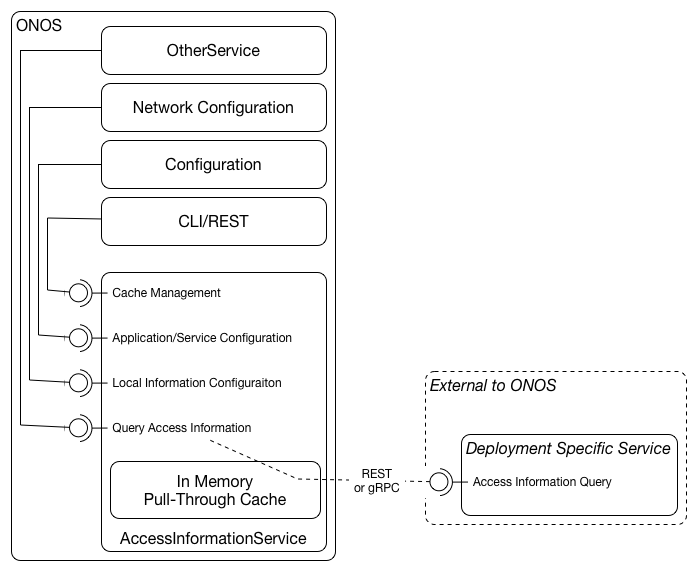

# Subscriber / Access Device Information Service (SADIS)

When deploying at a customer there is often a need to access per-subscriber /
access device information. This information is authoritatively stored by the
customer and made available to the residential CORD or VOLTHA deployment. The
purpose of this service is to define an optional service that provides a bridge
to the customer's infrastructure to query / cache subsciber/access information
and make it available to other services / applications within the ONOS/CORD
infrastructure.

### Overview

The below diagram is a high level block diagram for the Access Information
Service that runs as an ONOS application and will be used within the CORD/vOLTHA
context by other ONOS applications such as the DHCP Relay, iGMP, and AAA. The
basic concept is that the service can run in two modes: local mode - in local
mode the per subscriber / access device information can be established via
ONOS's network configuration capability. In this mode all queries are answered
based on the information from the network configuration remote mode - in the
remove mode the service is configured with a URL and this URL is used to query
an external source for subscriber / access device information using a URI
structure that is defined as part of this service. Information retrieved from
the external source is cached locally.



### Pull Through Cache

The cache used for the remote mode is considered a pull through cache in which
all queries are answered from the cache and if there is a cache miss the remote
API is used and the cache is populated.

To prevent the cache from growing indefinitely a policy, initially time/use
based, will be leveraged to kick / purge items from the cache. Additionally, the
cache can be influenced via manually operations of the the CLI/API exposed as
part of ONOS. The time limits for cache entry purging should be configurable.

### Service Configuration

The service is configurable via both the the network configuration as well as
via ONOS configuration. This configuration consists of service-wide properties
such as operation mode, remote URL, cache purge options, etc.

### Clustered Behavior

The in memory cache is not a clustered, distributed data structure, such that
each instance of ONOS in a cluster might have a different set of objects in its
cache. The thought behind this is that each instance in a cluster will be a
master for a different set of devices and thus needs different information.


### Configuration Paramters
```
"org.opencord.sadis" : {
      "sadis" : {
        "integration" : {
          "url": "http://localhost/src/test/resources/%s",
          "cache" : {
            "maxsize" : 50,
            "ttl" : "PT1m"
          }
        },
        "entries" : [ {
          "id" : "uni-1",
          "cTag" : 2,
          "sTag" : 2,
          "nasPortId" : "PON 1",
          "circuitId" : "VOLT-1",
        }, {
          "id" : "211702604597",
          "hardwareIdentifier" : "00:1e:67:d2:ef:66",
          "ipAddress" : "144.60.34.89",
          "nasId" : "66"
        }]
      }
    }
```
* __url__ - A url using which the subscriber and device data can be fetched. It is mandatory to have a `%s` in the url which will be substituted with the id for that subscriber/device to retrieve the data.
* __maxsize__ - Maximum number of entries that the cache may contain
* __ttl__ - Number of seconds after last access at which the cache entry expires

Entries can be for Subscribers and OLT Devices; they are differentiated by the id.
If the url is specified the data for the subscribers/devices are picked from there else the local data is used.

##### For a subscriber
* __id__ - Unique identifier for the subscriber. This should match the name of the logical port name for this subscriber as can be seen from the ONOS `ports` command
* __nasPortId__ - NAS Port Id to be used for this subscriber; for example in RADIUS messages
* __circuitId__ - Circuit Id to be used for this subscriber; for example in DHCP messages
* __uniTagList__ - List of information about the various services and tags for that subscriber
  * _uniTagMatch_ - The Tag from the CPE to match on
  * _ponCTag_ - C-Tag to be used for this subscriber
  * _ponSTag_ - S-Tag to be used for this subscriber
  * _usPonCTagPriority_ - P-bit value to set on the C-Tag for upstream traffic
  * _usPonSTagPriority_ - P-bit value to set on the S-Tag for upstream traffic
  * _dsPonCTagPriority_ - P-bit value to set on the C-Tag for downstream traffic
  * _dsPonSTagPriority_ - P-bit value to set on the S-Tag for downstream traffic
  * _technologyProfileId_ - Identifier of the techprofile to be used for the flows with these C and S Tags
  * _upstreamBandwidthProfile_ - Identifier of profile specifying the upstream bandwidths when using these VLANs
  * _downstreamBandwidthProfile_ - Identifier of profile specifying the upstream bandwidths when using these VLANs
  * _upstreamOltBandwidthProfile_ - In case of multi UNI this defines the upstream bandwidth profile for the flows on the OLT. It is always greater than the upstreamBandwidthProfile. Defaults to upstreamBandwidthProfile if not present
  * _downstreamOltBandwidthProfile_ - In case of multi UNI this defines the downstream bandwidth profile for the flows on the OLT. It is always greater than the downstreamOltBandwidthProfile. Defaults to downstreamOltBandwidthProfile if not present
  * _serviceName_ - An identifier to identify this specific service
  * _enableMacLearning_ - Should MAC address be learnt using the DHCP packets
  * _configuredMacAddress_ - Use this MAC address instead of learning it
  * _isDhcpRequired_ - Should DHCP traps be installed
  * _isIgmpRequired_ - Should IGMP traps be installed
  * _isPppoeRequired_- Should PPPoe traps be installed

##### For an OLT Device

* __id__ - Unique identifier for an OLT device. This should match the serial number of the device as can be seen from the ONOS `devices` command
* __hardwareIdentifier__ - MAC address for this device
* __ipAddress__ - IP address of this device
* __nasId__ - NAS Id to be used for this device; for example in RADIUS messages
* __nniDhcpTrapVid__ - This is the Vlan Id on which to trap the DHCP packets from the OLT NNI port to the controller. If this value is not present, then DHCP packets are trapped on all the VLANs from the NNI port. Also the `enableDhcpOnNni` and `enableDhcpV4` flags on the *olt app* should be enabled to use this vid on the downstream DHCP trap flows on the NNI port.

In the case of FTTB; the interpretation of the above fields for a subscriber is different. The FTTB services are identified using the below `serviceName` in the UniTagInformation:

* __DPU_MGMT_TRAFFIC__ - This UniTag information is needed for the DPU Management traffic
* __DPU_ANCP_TRAFFIC__ - This UniTag information is needed for DPU ANCP traffic
* __FTTB_SUBSCRIBER_TRAFFIC__ - This UniTag information is needed for the DPUs subscriber traffic

##### DPU_MGMT_TRAFFIC

The interpretation of the UniTagInformation attributes for this service are as below:

* _ponCTag_- Contains the VID_VENDOR_DPU_MGMT. This is the VLAN on which the DPU sends management traffic.
* _ponSTag_ - Contains the VID_NETWORK_DPU_MGMT. This is the VLAN on which the OLT needs to send the DPU management traffic upstream.
* _usPonSTagPriority_ - Contains the p-bit the DPU Management traffic needs to be remarked to. If this value is not present there would not be any p-bit re-marking done for the packets.
* _usPonCTagPriority_ - Contains the p-bit the DPU Management traffic that needs to be filtered on. If this value is not present there would not be any filtering.
* _technologyProfileId_ - The technology profile to use for the DPU Management traffic
* _upstreamBandwidthProfile_ - The bandwidth profile to use for upstream DPU Mgmt traffic
* _downstreamBandwidthProfile_ - The bandwidth profile to use for downstream DPU Mgmt traffic

##### DPU_ANCP_TRAFFIC

The interpretation of the UniTagInformation attributes for this service are as below:

* _ponCTag_ - Contains the VID_VENDOR_ANCP. This is the VLAN on which the DPU sends the ANCP traffic.
* _ponSTag_ - Contains the VID_NETWORK_ANCP. This is the VLAN on which the OLT needs to send the ANCP traffic upstream.
* _usPonSTagPriority_ -  Contains the p-bit the ANCP needs to be remarked to. If this value is not present there would not be any p-bit re-marking done for the packets.
* _usPonCTagPriority_ - Contains the p-bit the DPU Management traffic that needs to be filtered on. If this value is not present there would not be any filtering.
* _technologyProfileId_ - The technology profile to use for the ANCP traffic
* _upstreamBandwidthProfile_ - The bandwidth profile to use for upstream ANCP traffic
* _downstreamBandwidthProfile_ - The bandwidth profile to use for downstream ANCP traffic

##### FTTB_SUBSCRIBER_TRAFFIC

The interpretation of the UniTagInformation attributes for this service are as below:

* _ponCTag_ - Contains the ANP Tag (also could be called as the ingress outer tag)
* _ponSTag_ - Contains the S-Tag of the subscriber (also could be called as the egress outer tag, unique within the OLT)
* _uniTagMatch_ - Contains the VLAN of the inner tag of the subscriber traffic, 4096 in the case of matching to any inner vid (transparent)
* _technologyProfileId_ - The technology profile to use for the FTTB subscriber traffic
* _upstreamBandwidthProfile - The bandwidth profile to use for upstream FTTB subscriber traffic
* _downstreamBandwidthProfile_ - The bandwidth profile to use for downstream FTTB subscriber traffic
